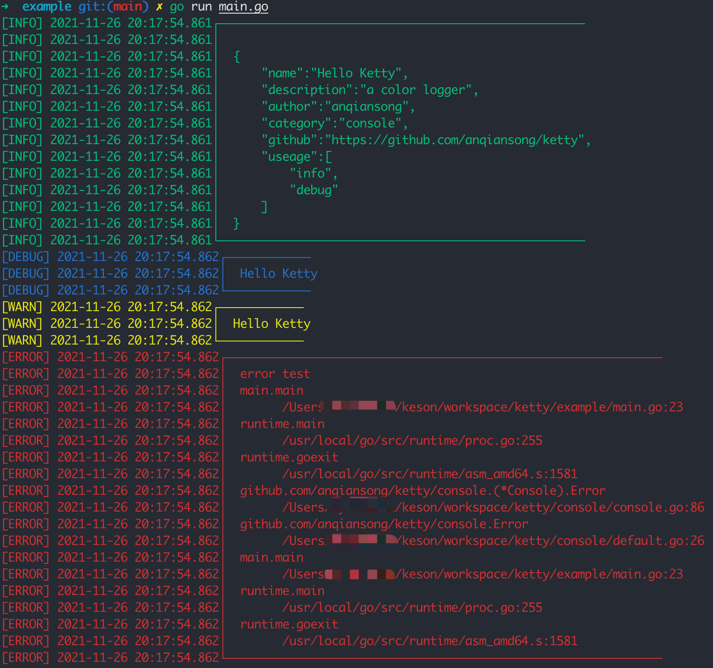
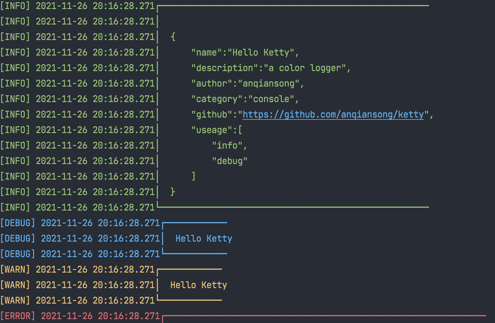
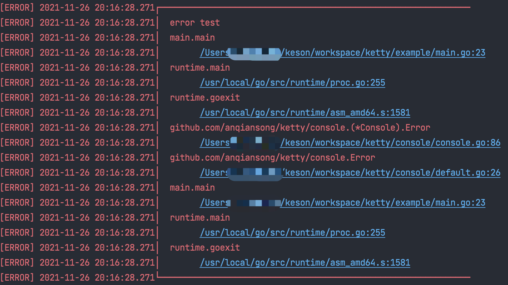

# Ketty

中文|[English](README_EN.md)

ketty 是一个Golang 开发的简单的日志美化输出 Logger。

## 安装

```bash
$ go install github.com/anqiansong/ketty@latest
```

## 快速开始

```go
func main(){
    console.Info(`
    {
        "name":"Hello Ketty",
        "description":"a color logger",
        "author":"anqiansong",
        "category":"console",
        "github":"https://github.com/anqiansong/ketty",
        "useage":[
            "info",
            "debug"
        ]
    }`)
    console.Debug("Hello Ketty")
    console.Warn("Hello Ketty")
    console.Error(errors.New("error test"))
}
```

## 终端显示


## Goland 显示



## 用法
TODO